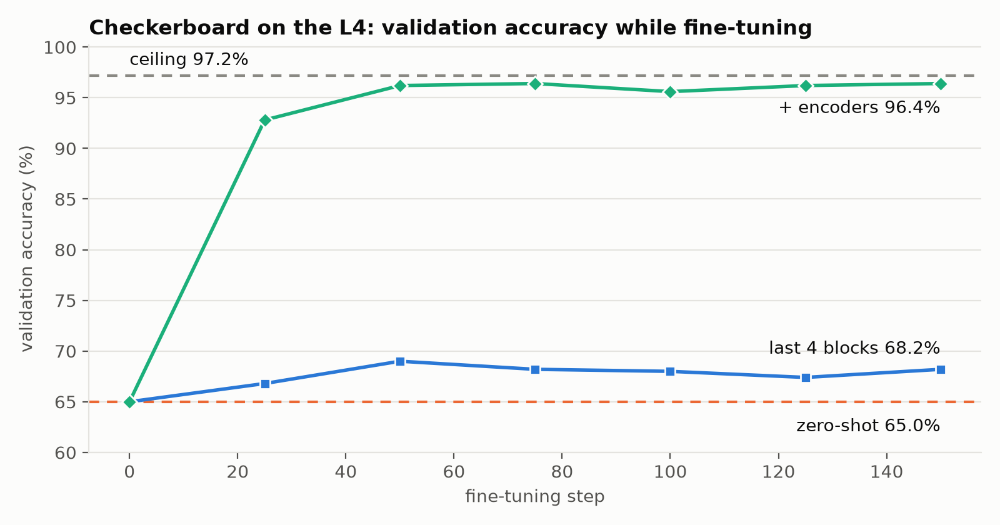

<div align="center">

<h2>Does fine-tuning a tabular foundation model beat its in-context learning, and can a laptop even do it?</h2>

[](https://github.com/glukicov/ltm_ft/actions/workflows/ci.yml)
[](LICENSE)
[](.python-version)
[](https://github.com/astral-sh/uv)
[](https://github.com/astral-sh/ruff)
[](https://mypy-lang.org)
<br>
[](https://github.com/google-research/tabfm)
[](https://pytorch.org)
[](https://arxiv.org/abs/2506.08982)

**[Results](#results) · [What we learned](#what-we-learned) · [How it works](#how-it-works) · [Quickstart](#quickstart) · [Layout](#layout) · [Licence](#licence) · [Slides](docs/slides)**

</div>

**LTM-FT: fine-tuning a large tabular model, hands-on.** A 101 on fine-tuning
[TabFM](https://github.com/google-research/tabfm), Google's 1.64B-parameter tabular foundation model,
on one Apple-silicon laptop, and measuring honestly whether it beats the model's own zero-shot
in-context learning on synthetic data where the best achievable score is known.

The sibling repo [glukicov/ltm](https://github.com/glukicov/ltm) showed TabFM matching a trained
CatBoost model *without any training*. The obvious next question: what if we do train it? The recipe
follows Rubachev et al., [*On Finetuning Tabular Foundation Models*](https://arxiv.org/abs/2506.08982)
(2025), and Prior Labs' TabPFN fine-tuning examples
([classifier](https://github.com/PriorLabs/TabPFN/blob/main/examples/finetune_classifier.py),
[regressor](https://github.com/PriorLabs/TabPFN/blob/main/examples/finetune_regressor.py)).

**TL;DR**

- ♟️ **Where zero-shot TabFM is weak** (a checkerboard, 69.1% vs a 94.9% ceiling), fine-tuning helped:
  test log loss −0.021 and ROC AUC +0.008, both outside their 95% bootstrap intervals. Real, and small.
- 🏃 **Where it is already strong** (a messy, realistic table), every fine-tuning step made validation
  worse; early stopping kept the original model.
- 🪤 **Precision is part of the model:** the same checkpoint computed in float32 loses ~11 ROC AUC
  points, so we fine-tune a bf16 model with float32 master weights.

> Reading not your game? Slides instead: [15 slides, HTML + PDF](docs/slides) 🖥️

## Results


Each task has 1,500 labelled rows (TabFM's context and the fine-tuning data), 500 validation rows
for early stopping, and **3,000 held-out test rows, scored before and after fine-tuning**. The
labels are drawn from known probabilities, so the ceiling is the best score any model could reach.
Fine-tuned: the last 4 of 24 ICL blocks + head, lr 3e-4, up to 150 steps, best validation step kept.

### ♟️ Checkerboard: fine-tuning helps, measurably and a little ([`outputs/checkerboard`](outputs/checkerboard/summary.md))

Ten uniform features; the label depends only on which square of a 6×6 board the first two fall in.
Zero-shot TabFM is far from the ceiling here, so there is room to improve.

| Model | Log loss | ROC AUC | Accuracy |
|---|---|---|---|
| TabFM zero-shot | 0.6140 | 0.7642 | 69.1% |
| **TabFM fine-tuned** (step 75 of 150) | **0.5934** | **0.7721** | 69.7% |
| Generator's true probabilities (ceiling) | 0.2016 | 0.9490 | 94.9% |

| Fine-tuned minus zero-shot (same 3,000 rows) | Δ | 95% paired-bootstrap interval |
|---|---|---|
| Log loss | **−0.021** | [−0.024, −0.018] |
| ROC AUC | **+0.008** | [+0.002, +0.014] |
| Accuracy | +0.6 pts | [−0.6, +1.8] |

Better probabilities and ranking, significantly; the same decisions, within noise. It closes ~5% of
the log-loss gap to the ceiling, after 21 minutes of fine-tuning on an Apple M4.



### 🏃 Runners: nothing to win ([`outputs/runners`](outputs/runners/summary.md))

The messy 21-column running-injury table from [glukicov/ltm](https://github.com/glukicov/ltm).

| Model | Log loss | ROC AUC | Accuracy |
|---|---|---|---|
| TabFM zero-shot | 0.5267 | 0.8240 | 74.8% |
| TabFM fine-tuned (early stopping kept step 0) | 0.5267 | 0.8240 | 74.8% |
| Generator's true probabilities (ceiling) | 0.4732 | 0.8537 | 77.8% |

Every validation check after a gradient step was worse than zero-shot (log loss 0.4651 at step 0;
0.4712, 0.4684, 0.4683 at steps 25–75), so early stopping kept the original weights and the test
predictions are identical.

> [!IMPORTANT]
> **Caveats.** One seed and one split per task, 1,500 training rows, 17% of the model trained for at
> most 150 steps on a laptop. The paper fine-tunes the whole model on an 80 GB GPU, on datasets averaging
> ~15k rows and for longer, and finds the gains grow with dataset size: read these effects
> as a floor. The checkerboard was chosen *because* zero-shot TabFM is weak on it.

## What we learned

1. **Check the headroom first.** On the realistic table, zero-shot TabFM was within 3 accuracy points
   of the ceiling and fine-tuning found nothing. It also shrugged off 100 appended columns of pure
   noise: validation log loss 0.4651 → 0.4672, accuracy 76.4% → 75.8%
   ([`outputs/tune`](outputs/tune)). The paper reports the same pattern: on small datasets,
   fine-tuning gains are often statistically insignificant.
2. **Fine-tuning helps where in-context learning struggles.** On the checkerboard, log loss and
   ROC AUC improved outside their 95% intervals. On a laptop budget the effect is small.
3. **Precision is part of the model.** The same checkpoint computed in float32 is much worse than in
   its native bfloat16 ([`outputs/precision`](outputs/precision/checkerboard.json), 500 validation
   rows, 2 ensemble members):

   | Checkerboard, zero-shot | Log loss | ROC AUC | Accuracy |
   |---|---|---|---|
   | bfloat16 (library default) | 0.6077 | 0.7749 | 70.2% |
   | float32 (`dtype=None`) | 0.6495 | 0.6658 | 59.8% |

   The textbook "upcast what you train to float32" silently changes the model before the first
   step, so we keep the model in bf16 and hold float32 master weights in the optimiser. A test
   asserts that the prepared model predicts exactly like the stock one.
4. **Train on the tensors you deploy.** Episodes are built by `TabFMClassifier`'s own
   preprocessing, and a test asserts their logits match the classifier's.

## How it works

TabFM predicts a query row from labelled *context* rows in one forward pass. Fine-tuning keeps that
interface and trains it:

1. **Sample an episode** from the training rows: 512 context rows whose labels the model sees, and
   256 other query rows whose labels it must predict.
2. **Build the tensors with the stock `TabFMClassifier` preprocessing**: the same categorical
   encoding, normalisation, random feature order and class-label shift it uses at inference (one
   random ensemble view per step, which doubles as augmentation). A test checks that the episode's
   logits equal the classifier's own.
3. **Take an AdamW step** on the query rows' cross-entropy: lr 3e-4, weight decay 0.01, gradient
   clipping at 1.0, linear warmup then cosine decay.
4. **Validate** every 25 steps with the full training set as context, exactly as the test is scored,
   and keep the best step (early stopping).
5. **Score the same test rows** before and after with the unmodified `TabFMClassifier`, and put a
   paired bootstrap interval on the difference.

Two constraints shaped the implementation:

- **Memory.** 1.62B of the 1.64B parameters sit in the 24-block in-context-learning transformer.
  Full fine-tuning with AdamW needs ~26 GB, more than a 24 GB laptop has. We train the **last 4 ICL
  blocks + head (277M parameters)**, one of the partial schemes the paper found close to full
  fine-tuning. Frozen parameters record no autograd graph, so no custom forward pass is needed:
  ~10 GB peak, 15-30 s per step on an M4. Also training the row/column encoders (`--train-encoders`)
  needs a backward pass through all 24 blocks and took 249 s per step here (with the laptop swapping).
- **Precision.** TabFM is designed to *compute* in bfloat16. The same checkpoint computed in float32
  is markedly worse on the checkerboard (see [What we learned](#what-we-learned)), and even
  `torch.autocast` changes its predictions. So the model is never upcast: trainable weights stay
  bf16 in the model and the optimiser keeps **float32 master copies** (`Float32Master`). Step 0 is
  bit-for-bit the stock model, and the fine-tuned result is a plain bf16 TabFM.

## Quickstart

Requirements: [uv](https://docs.astral.sh/uv/), and an Apple-silicon GPU (MPS) or CUDA GPU with
~12 GB free. Python 3.14 is pinned in `.python-version`. TabFM downloads ~6.6 GB of classification
weights from Hugging Face on first use.

```bash
git clone https://github.com/glukicov/ltm_ft && cd ltm_ft
uv sync

uv run ltm-ft data --task checkerboard                      # the split and its ceiling, no model needed
uv run ltm-ft run --task checkerboard --name checkerboard   # zero-shot -> fine-tune -> same test rows (~30 min on an M4)
uv run ltm-ft run --task runners --name runners             # the realistic table
uv run ltm-ft tune --task checkerboard --name my-lr --learning-rate 1e-4   # validation curve only, no test rows
uv run ltm-ft precision --task checkerboard                 # bf16 vs float32, same checkpoint
uv run ltm-ft plot                                          # figures from outputs/
```

> [!TIP]
> `tune` never generates test rows, so choose hyperparameters with it; `run` scores the test set
> exactly twice. Every number in this README is in `outputs/*/results.json`.

## Layout

```
src/ltm_ft/
  data.py        synthetic tasks with known probabilities: runners, checkerboard (+ optional junk columns)
  model.py       load TabFM, choose trainable modules (last ICL blocks, optionally the encoders)
  finetune.py    episodes from the stock preprocessing, float32 master weights, AdamW, early stopping
  evaluate.py    log loss / ROC AUC / accuracy, the ceiling, paired bootstrap
  plots.py       figures, rendered only from outputs/
  cli.py         ltm-ft run | tune | data | precision | plot
tests/           tiny random TabFM on CPU: logits parity with the stock classifier, freezing, master weights
outputs/         committed results: results.json, summary.md, test_predictions.csv per run
docs/figures/    README figures
docs/slides/     the slide deck (HTML + PDF), citations checkable with SlideOps
```

## Licence

The code in this repository is [MIT](LICENSE)-licensed. TabFM's pretrained weights are **not**
covered by it: they are downloaded from Hugging Face under Google's separate
`tabfm-non-commercial-v1.0` licence, and fine-tuned weights derive from them, so none are committed
(`--save-weights` writes them locally, gitignored). All data is synthetic.

## Development

```bash
uv sync
uv run ruff check . && uv run ruff format --check .
uv run mypy          # strict
uv run pytest        # ~10 s, no checkpoint download
```

CI runs the same on every push and pull request, with CPU-only PyTorch. See [CONTRIBUTING.md](CONTRIBUTING.md)
for the invariants that are easy to break.

<div align="center">
<br>

**[Results](#results) · [How it works](#how-it-works) · [Quickstart](#quickstart) · [glukicov/ltm](https://github.com/glukicov/ltm) · [TabFM](https://github.com/google-research/tabfm)**

</div>
