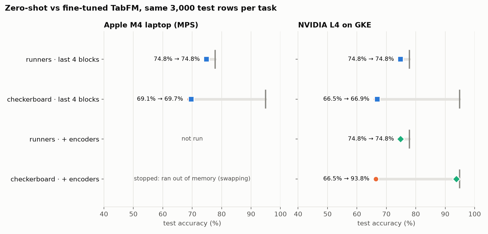
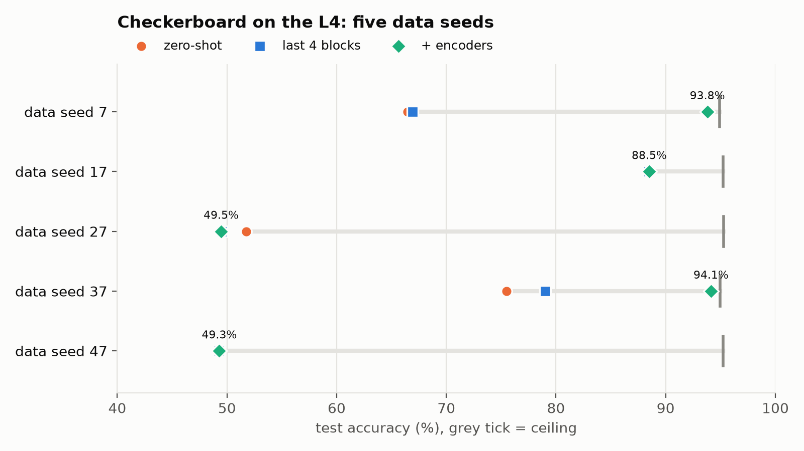
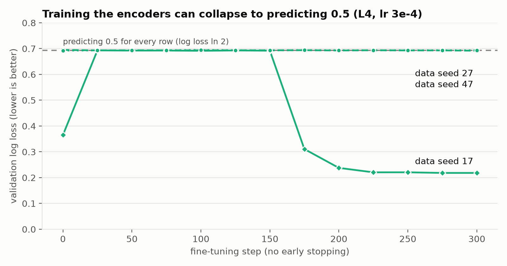
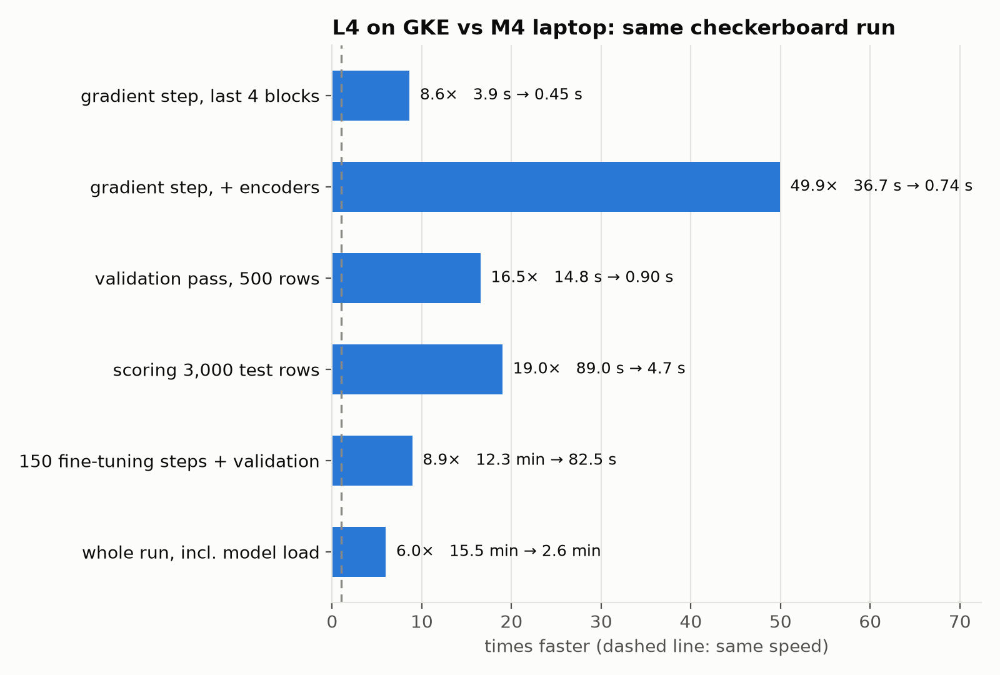

<div align="center">

<h2>Does fine-tuning a tabular foundation model beat its in-context learning, and what does a real GPU change?</h2>

[](https://github.com/glukicov/ltm_ft/actions/workflows/ci.yml)
[](LICENSE)
[](.python-version)
[](https://github.com/astral-sh/uv)
[](https://github.com/astral-sh/ruff)
[](https://mypy-lang.org)
<br>
[](https://github.com/google-research/tabfm)
[](https://pytorch.org)
[](k8s/gke)
[](https://arxiv.org/abs/2506.08982)

**[Results](#results) · [Laptop vs GPU](#laptop-vs-gpu) · [What we learned](#what-we-learned) · [How it works](#how-it-works) · [Quickstart](#quickstart) · [Layout](#layout) · [Slides](docs/slides)**

</div>

**LTM-FT: fine-tuning a large tabular model, hands-on.** A 101 on fine-tuning
[TabFM](https://github.com/google-research/tabfm), Google's 1.64B-parameter tabular foundation model,
measured honestly against the model's own zero-shot in-context learning on synthetic data where the
best achievable score is known. The same code runs **on an Apple M4 laptop** and **as a Kubernetes
Job on an NVIDIA L4 in GKE**, so the write-up compares both the accuracy and what the hardware costs.

The sibling repos set this up: [glukicov/ltm](https://github.com/glukicov/ltm) showed TabFM matching
a trained CatBoost model *without any training*, and [glukicov/ltm_serve](https://github.com/glukicov/ltm_serve)
served it on GKE (this repo reuses its cluster pattern). The recipe follows Rubachev et al.,
[*On Finetuning Tabular Foundation Models*](https://arxiv.org/abs/2506.08982) (2025), and Prior Labs'
TabPFN fine-tuning examples ([classifier](https://github.com/PriorLabs/TabPFN/blob/main/examples/finetune_classifier.py),
[regressor](https://github.com/PriorLabs/TabPFN/blob/main/examples/finetune_regressor.py)).

**TL;DR**

- ⚡ **On an NVIDIA L4, fine-tuning ran 9× faster than on the laptop, and ~50× faster for the variant
  that pushes the laptop into swap.** A whole checkerboard run took 15.5 min on the M4 and 2.6 min on
  the L4. The GKE session (20 runs, 1.05 GPU-hours) cost **~$1.30** in compute at list price.
- ♟️ **Fine-tuning can nearly reach the ceiling where zero-shot TabFM is weak**: training the
  row/column encoders took a checkerboard from 66.5% to **93.8%** (ceiling 94.9%).
- 🎲 **But only on 2 of 5 data seeds.** On the others it collapsed to predicting 0.5 for every
  row; one seed recovered after ~175 steps when trained longer, two never did at any learning rate tried. A single seed
  would have told a much better story than the truth.
- 🏃 **On a realistic table there was nothing to win**: not on the laptop, not on the L4, not with
  the encoders.
- 🪤 **Precision and hardware are part of the model:** the same checkpoint scores 59.8% (float32,
  both machines), 65.0% (bfloat16 on CUDA) and 70.2% (bfloat16 on MPS) on the same validation rows.

> Reading not your game? Slides instead: [HTML + PDF](docs/slides) 🖥️

## Results



Each task has 1,500 labelled rows (TabFM's context and the fine-tuning data), 500 validation rows for
early stopping, and **3,000 held-out test rows scored before and after fine-tuning**. Labels are drawn
from known probabilities, so the *ceiling* is the best score any model could reach. Two variants:

- **last 4 blocks**: the last 4 of 24 in-context-learning (ICL) blocks + head, 277M parameters;
- **+ encoders**: the same plus the cell/column/row encoders in front of the ICL transformer, 297M
  parameters, which needs a backward pass through all 24 blocks.

Both: AdamW lr 3e-4, up to 150 steps, validation every 25 steps, best step kept (patience 3).

### Same recipe, two machines ([`outputs/m4`](outputs/m4), [`outputs/l4`](outputs/l4))

| Checkerboard, data seed 7 | Zero-shot | Fine-tuned (last 4 blocks) | Δ log loss [95% CI] | Δ accuracy [95% CI] |
|---|---|---|---|---|
| Apple M4 (MPS) | 69.1%, log loss 0.614 | 69.7%, 0.593 | **−0.021** [−0.024, −0.018] | +0.6 pts [−0.6, +1.8] |
| NVIDIA L4 (CUDA) | 66.5%, log loss 0.623 | 66.9%, 0.607 | **−0.017** [−0.020, −0.014] | +0.5 pts [−0.9, +1.8] |

The same small, statistically significant log-loss gain on both machines, with accuracy within noise.
The zero-shot starting points differ (69.1% vs 66.5%) because bfloat16 kernels differ between MPS and
CUDA, and this task sits on a numerical knife edge (see [precision](#what-we-learned)).

### ♟️ Checkerboard: training the encoders works, sometimes ([`outputs/l4/seeds`](outputs/l4/seeds))

Ten uniform features; the label depends only on which square of a 6×6 board the first two fall in.



| L4, 3,000 test rows | Zero-shot | Last 4 blocks | + encoders | Ceiling |
|---|---|---|---|---|
| data seed 7 | 66.5% | 66.9% | **93.8%** (log loss −0.399 [−0.422, −0.374]) | 94.9% |
| data seed 17 | 88.5% | 88.5% | 88.5% (early stopping kept step 0) | 95.2% |
| data seed 27 | 51.8% | 49.5% | 49.5% | 95.3% |
| data seed 37 | 75.5% | **79.0%** (+3.5 pts [+2.6, +4.6]) | **94.1%** (+18.6 pts [+17.1, +20.1]) | 95.0% |
| data seed 47 | 49.3% | 49.3% | 49.3% | 95.2% |

Where the encoder variant works, it closes ~95% of the log-loss gap to the ceiling in 75–150 steps.
Where it doesn't, the reason is visible on validation (training up to 300 steps, no early stopping,
[`outputs/l4/tune`](outputs/l4/tune)):



- **Seed 17** starts well (85.8% validation), collapses to predicting 0.5 (log loss ln 2) for 150
  steps, then recovers to **94.2%** by step 300 (validation ceiling 95.0%). Patience cut it off at
  step 150, one evaluation before the recovery.
- **Seeds 27 and 47** start at 0.5 and never leave it: not at lr 1e-4, 3e-4 or 1e-3.

### 🏃 Runners: nothing to win ([`outputs/m4/runners`](outputs/m4/runners/summary.md), [`outputs/l4`](outputs/l4))

The messy 21-column running-injury table from [glukicov/ltm](https://github.com/glukicov/ltm): zero-shot
74.8% against a 77.8% ceiling. Every validation check after a
gradient step was worse than zero-shot, so early stopping kept the original weights: on both machines
with the last 4 blocks, and on the L4 with the encoders too.

> [!IMPORTANT]
> **Caveats.** 1,500 training rows; at most 150 steps (300 for the diagnostic curves); five seeds for
> one synthetic task, one for the others. The checkerboard was chosen *because* zero-shot TabFM is weak
> on it. The paper fine-tunes the whole model on an 80 GB GPU, for longer, on datasets averaging ~15k
> rows. Laptop timings vary with what else the machine is doing: the same test pass took 52 s and 126 s.

## Laptop vs GPU



| Checkerboard, data seed 7 | Apple M4 laptop | NVIDIA L4 on GKE | L4 speed-up |
|---|---|---|---|
| Gradient step, last 4 blocks (median) | 3.87 s | 0.45 s | **8.6×** |
| Gradient step, + encoders (median) | 36.7 s clean; 96–135 s once swapping | 0.74 s | **~50×** |
| Validation pass, 500 rows | 14.8 s | 0.90 s | 16.5× |
| 150 steps + 7 validations | 12.3 min | 82.5 s | 8.9× |
| Whole run, incl. model load and both test passes | 15.5 min | 2.6 min | 6.0× |
| Peak accelerator memory, + encoders | 17.9 GB of 24 GB unified | 14.9 GB of 24 GB | |

- **Memory, not speed, is what stops the laptop.** The encoder variant needs ~18 GB; with the OS and
  other apps on the same 24 GB, macOS swapped 15 GB and steps went from 6–17 s to 96–135 s, so the full
  run was stopped ([`checkerboard_encoders_attempt.json`](outputs/m4/checkerboard_encoders_attempt.json)).
  On the L4 the same run finished in 2.6 minutes.
- **Kubernetes adds minutes once, then seconds.** From Job creation, a cold GPU node took 53 s to exist
  and the 2 min 3 s image pull dominated: first container start at 3 min 48 s. Later Jobs on the warm
  node started in ~1 s ([`timeline-*.json`](outputs/l4)). One-off setup: image build 8 min 4 s, cluster
  4 min 5 s ([`setup.json`](outputs/l4/setup.json)).
- **It is cheap.** List price in us-central1: `g2-standard-8` (1× L4) **$0.854/h** on demand, $0.512/h
  Spot. One full checkerboard run is ~$0.04 of GPU time. The session's L4 node was up 1.28 h ($1.09)
  plus the system node ($0.18); the experiments themselves used 1.05 GPU-hours
  ([`session.json`](outputs/l4/session.json)).
- **Speed changed what we could afford to check.** Five seeds × two variants took 20 minutes on the
  L4; at the swapping step times we measured, the encoder half alone would have taken the laptop most of a day. That check is what
  turned "fine-tuning reaches the ceiling" into "2 of 5 seeds".

## What we learned

1. **Check the headroom first.** On the realistic table zero-shot TabFM was within 3 points of the
   ceiling, and nothing we trained got closer. It also ignored 100 appended columns of pure noise:
   validation log loss 0.4651 → 0.4672 ([`outputs/m4/tune`](outputs/m4/tune)).
2. **Which weights you train matters more than how long.** The last 4 blocks moved the checkerboard by
   a fraction of a point; adding ~20M encoder parameters moved it to the ceiling when it worked. The
   paper found partial and full fine-tuning close on its benchmarks; here the encoders were the part
   that mattered.
3. **Run more than one seed.** Seed 7 alone suggested a +27-point win. Five seeds showed a recipe that
   works 2 times in 5 and can collapse to predicting 0.5. Early stopping on a collapse can also hide a
   later recovery (seed 17).
4. **Precision and hardware are part of the model.** Same checkpoint, same 500 validation rows
   ([`m4`](outputs/m4/precision/checkerboard.json), [`l4`](outputs/l4/precision/checkerboard.json)):

   | Checkerboard, zero-shot | Log loss | ROC AUC | Accuracy |
   |---|---|---|---|
   | float32, M4 **and** L4 | 0.6495 | 0.6658 | 59.8% |
   | bfloat16, L4 (CUDA) | 0.6323 | 0.7244 | 65.0% |
   | bfloat16, M4 (MPS) | 0.6077 | 0.7749 | 70.2% |

   float32 is identical across devices; bfloat16 is not. So the model is never upcast for training:
   it stays bf16 and the optimiser holds float32 master weights, and a test asserts that step 0 is the
   stock model.
5. **A dedicated GPU is worth it the moment you iterate.** 9× per run is nice; being able to run
   the seed and learning-rate checks at all is the real difference.

## How it works

TabFM predicts a query row from labelled *context* rows in one forward pass. Fine-tuning keeps that
interface and trains it:

1. **Sample an episode** from the training rows: 512 context rows whose labels the model sees, and
   256 other query rows whose labels it must predict.
2. **Build the tensors with the stock `TabFMClassifier` preprocessing** (encoding, normalisation,
   feature order, class-label shift), one random ensemble view per step. A test checks that the
   episode's logits equal the classifier's own.
3. **Take an AdamW step** on the query rows' cross-entropy: lr 3e-4, weight decay 0.01, gradient
   clipping at 1.0, linear warmup then cosine decay, on float32 master copies of bf16 weights.
4. **Validate** every 25 steps with the full training set as context, and keep the best step.
5. **Score the same test rows** before and after with the unmodified `TabFMClassifier`, with a paired
   bootstrap interval on the difference. Every step and pass is timed (synchronised) and recorded.

**Memory.** 1.62B of the 1.64B parameters sit in the ICL transformer; full fine-tuning with AdamW needs
~26 GB, more than either 24 GB device has. Frozen parameters record no autograd graph, so no custom
forward pass is needed.

**On GKE** ([`k8s/gke`](k8s/gke), adapted from [ltm_serve](https://github.com/glukicov/ltm_serve)): a
zonal cluster with an L4 node pool that scales from zero; Cloud Build builds
[`docker/finetune.Dockerfile`](docker/finetune.Dockerfile) (the same lockfile, CUDA torch); each
`finetune.sh` call runs a list of `ltm-ft` commands as one Job, and `collect.sh` copies `outputs/` back,
writes the timeline and deletes the Job. TabFM's weights are downloaded inside the pod, never baked
into the image.

## Quickstart

Requirements: [uv](https://docs.astral.sh/uv/), Python 3.14 (pinned). TabFM downloads ~6.6 GB of weights
from Hugging Face on first use.

**On a laptop or workstation** (Apple-silicon MPS or a CUDA GPU with ~12 GB free; ~18 GB for `--train-encoders`):

```bash
git clone https://github.com/glukicov/ltm_ft && cd ltm_ft && uv sync

uv run ltm-ft data --task checkerboard                                  # the split and its ceiling, no model
uv run ltm-ft run --task checkerboard --name m4/checkerboard            # zero-shot -> fine-tune -> same test rows
uv run ltm-ft run --task checkerboard --train-encoders --name m4/enc    # also train the encoders
uv run ltm-ft tune --task checkerboard --name my-lr --learning-rate 1e-4   # validation curve only, no test rows
uv run ltm-ft precision --task checkerboard --name m4/precision/checkerboard
uv run ltm-ft plot                                                      # figures from outputs/
```

**On GKE** (needs `gcloud`, `kubectl`, `envsubst`, a project with L4 quota; billed until `down.sh`):

```bash
gcloud config set project <your-project>
k8s/gke/up.sh                                   # image (Cloud Build) + cluster with an L4 pool scaling from 0
k8s/gke/finetune.sh "run --task checkerboard --name l4/checkerboard" \
                    "run --task checkerboard --train-encoders --name l4/checkerboard_encoders"
k8s/gke/down.sh                                 # delete the cluster, image repository and build uploads
```

> [!TIP]
> `tune` never generates test rows, so choose hyperparameters with it; `run` scores the test set
> exactly twice. Every number in this README is in `outputs/*/*.json`.

## Layout

```
src/ltm_ft/
  data.py          synthetic tasks with known probabilities: runners, checkerboard (+ optional noise columns)
  model.py         load TabFM, choose trainable modules (last ICL blocks, optionally the encoders)
  finetune.py      episodes from the stock preprocessing, float32 master weights, AdamW, early stopping, timing
  hardware.py      synchronised timing, peak memory and device names on MPS, CUDA and CPU
  evaluate.py      log loss / ROC AUC / accuracy, the ceiling, paired bootstrap
  plots.py         figures, rendered only from outputs/
  cli.py           ltm-ft run | tune | data | precision | plot
tests/             tiny random TabFM on CPU: logits parity, freezing, master weights, the full loop
docker/            CUDA image for GKE, requirements generated from uv.lock
k8s/gke/           up.sh, finetune.sh + collect.sh (Job, outputs, timeline), down.sh, timeline.py
outputs/m4/        Apple M4 laptop results          outputs/l4/   NVIDIA L4 results, seeds, timelines, cost
docs/figures/      README figures                   docs/slides/  the slide deck (HTML + PDF)
```

## Licence

The code in this repository is [MIT](LICENSE)-licensed. TabFM's pretrained weights are **not**
covered by it: they are downloaded from Hugging Face under Google's separate
`tabfm-non-commercial-v1.0` licence, and fine-tuned weights derive from them, so none are committed
or baked into images. All data is synthetic.

## Development

```bash
uv sync
uv run ruff check . && uv run ruff format --check .
uv run mypy                                       # strict
uv run pytest                                     # ~10 s, no checkpoint download
shellcheck -x k8s/gke/*.sh k8s/gke/kctl docker/requirements.sh
```

CI runs the same on every push and pull request, with CPU-only PyTorch. See [CONTRIBUTING.md](CONTRIBUTING.md)
for the invariants that are easy to break.

<div align="center">
<br>

**[Results](#results) · [Laptop vs GPU](#laptop-vs-gpu) · [Quickstart](#quickstart) · [glukicov/ltm](https://github.com/glukicov/ltm) · [glukicov/ltm_serve](https://github.com/glukicov/ltm_serve) · [TabFM](https://github.com/google-research/tabfm)**

</div>
